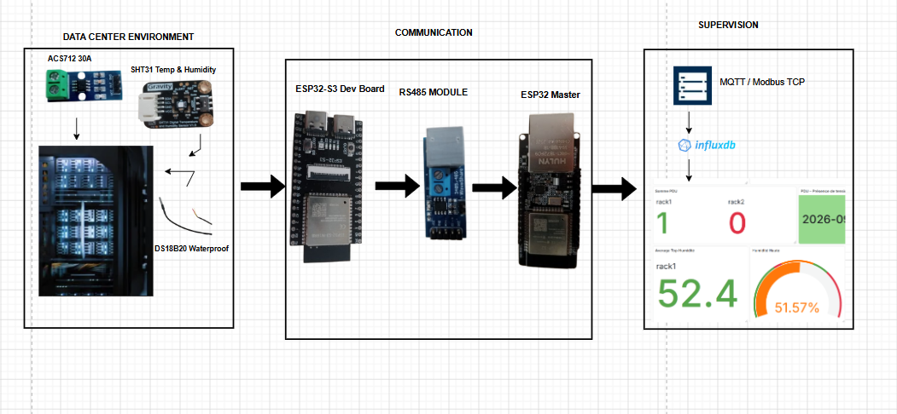

<div align="center">

# DCIM — Data Center Infrastructure Monitoring System

### IoT-Based Monitoring, Data Acquisition and Visualization Platform

<br>

<p>
  
</p>

<p>
  <b>ESP32 · RS-485 · Modbus RTU · Modbus TCP · MQTT · InfluxDB · Grafana · Ethernet</b>
</p>

</div>

---

## Overview

DCIM is an IoT-based Data Center Infrastructure Monitoring system designed
to collect physical infrastructure measurements, transmit them through an
industrial communication architecture, centralize the collected data, and
present it through a real-time monitoring platform.

The project was developed around a distributed architecture composed of
sensor acquisition nodes, an RS-485 communication bus, an ESP32-based
gateway, and an Ethernet-connected supervision layer.

The monitoring platform provides real-time visualization together with
historical data analysis and threshold-based monitoring.

The overall workflow can be summarized as:

**Measure → Transmit → Centralize → Store → Visualize → Alert → Analyze**

---

# Project Objectives

The main objective of the project was to develop a monitoring architecture
capable of collecting information from infrastructure and making it
available through a centralized supervision platform.

The system was designed to address several requirements:

- Acquire physical measurements from sensors
- Process measurements at the acquisition level
- Connect distributed nodes through an RS-485 bus
- Use Modbus RTU for field communication
- Forward collected information through an Ethernet gateway
- Support MQTT and Modbus TCP communication
- Centralize measurement data
- Store historical measurements
- Provide real-time visualization
- Monitor predefined thresholds
- Support alert generation
- Enable historical analysis of infrastructure measurements

---

# System Architecture

The system follows a distributed Master/Slave architecture.

The **ESP32-S3 Slave** acts as a local data acquisition node, while the
**ESP32-ETH Master** acts as a gateway between the RS-485 field network and
the Ethernet-based supervision layer.

<p align="center">
  
</p>

### High-Level Data Flow

```text
┌──────────────────────────┐
│   DATA CENTER           │
│   ENVIRONMENT           │
│                          │
│ Temperature              │
│ Humidity                 │
│ Current                  │
│ Voltage / AC Presence    │
└────────────┬─────────────┘
             │
             ▼
┌──────────────────────────┐
│    ESP32-S3 SLAVE        │
│                          │
│ Sensor Acquisition       │
│ Local Processing         │
│ Modbus RTU               │
└────────────┬─────────────┘
             │
             │ RS-485
             │
             ▼
┌──────────────────────────┐
│    ESP32-ETH MASTER      │
│        GATEWAY           │
│                          │
│ Modbus RTU               │
│ Modbus TCP               │
│ MQTT                     │
│ Ethernet                 │
└────────────┬─────────────┘
             │
             │ Ethernet
             ▼
┌──────────────────────────┐
│   SUPERVISION PLATFORM   │
│                          │
│ MQTT / Modbus TCP         │
│ InfluxDB                 │
│ Grafana                  │
└────────────┬─────────────┘
             │
             ▼
┌──────────────────────────┐
│ MONITORING & ANALYSIS    │
│                          │
│ Real-Time Visualization  │
│ Threshold Detection      │
│ Alerts                   │
│ Historical Analysis      │
└──────────────────────────┘
